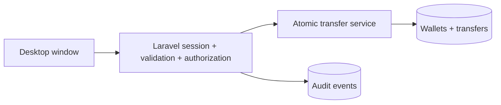

# Security design and demonstration

## Overview

A simulated wallet runs in Laravel. The Electron window loads its loopback interface for a single-machine classroom demonstration. Authenticated users can view their own balance and history, and transfer simulated PKR to another seeded user. The server owns all transfer decisions. The SQLite database stores users, wallets, transfers, and audit events.

## Security Design Table

| ID | Asset / component | Weakness | Impact | Control and location | Verification |
|---|---|---|---|---|---|
| W1 | Login credentials | Guessing or password exposure | Account takeover | Password hashing in User model; session regeneration and login throttle in WalletController | Wrong password fails, stored password is hashed, repeated attempts are rejected |
| W2 | Balance and history | IDOR through user-controlled wallet ID | Confidentiality breach | Dashboard queries use the authenticated user ID; no customer route accepts a wallet ID | Add `wallet_id` to URL; another user's transfer does not appear |
| W3 | Transfer authority | Over-posted sender or balance field | Unauthorized debit or credit | Transfer controller accepts only recipient, amount, request ID; sender comes from session | Forge `sender_id`/`balance_paisa`; balance of authenticated sender changes only |
| W4 | Transfer state | Insufficient funds or one-sided update | Incorrect balances | Conditional debit plus credit and record insertion in one DB transaction | Overdraft rejected; balances and count remain unchanged |
| W5 | Transfer request | Duplicate submission / replay | Double payment | Unique request ID and same-parameters repeat lookup in TransferService | Submit identical request twice; one transfer recorded |
| W6 | Accountability | No record of login and payment actions | Hard to investigate failures | Audit events in controller with event, user, IP and minimal details | Inspect audit_events after login and transfer |

## Before/after evidence protocol

Use only local seeded test accounts. Capture the same request before and after each control in an isolated teaching branch, then delete that branch from the delivered application. For W2, temporarily query a user-supplied wallet ID in a throwaway branch; after implementing the current authenticated-user query, the modified ID cannot disclose a balance. For W3, temporarily use a user-supplied sender ID; after the current control, sending the same forged field cannot choose the debit wallet. Preserve screenshots and test outputs in the final course report. The delivered main branch contains only the secured implementation. The automated tests in `tests/Feature/WalletSecurityTest.php` demonstrate the final behavior.

## Limits

This is a single-machine course prototype with simulated funds. It does not provide a separately deployable standalone installer, real-money settlement, MFA, durable tamper-evident auditing, customer recovery, fraud screening, backup testing, or production operations. Concurrent writers on a production system require further testing with a shared database, isolation rules, and reconciliation. Audit logs must be protected separately to resist an administrator with database write access.
